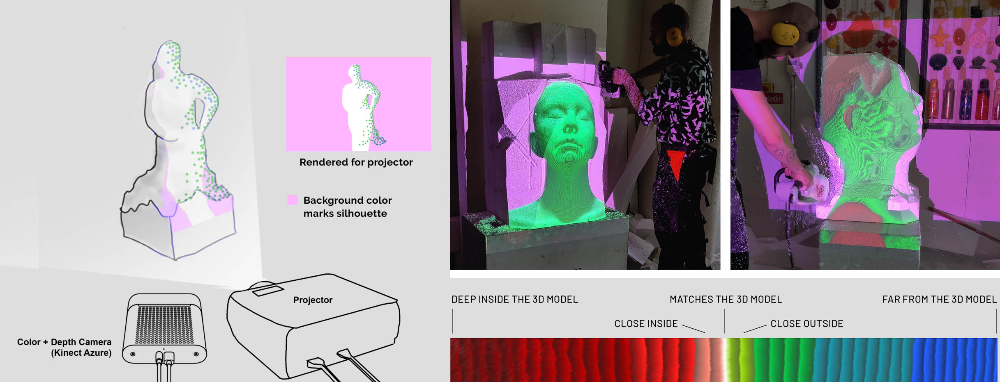

# projection-assisted-sculpting

This repository contains source code for the project ***Sculpting with SARA (Spatial Augmented Reality Assistance)***.

We explore how new digital technologies (such as “Spatial Augmented Reality”) can assist sculpting in the physical space after a 3D-model. The goal is to develop digital tools in a collaborative way that can visually guide an artist in the work of manual transfer of digital to physical three-dimensional form. These digital tools, together with the artist’s manual work, could become an alternative to machine-controlled 3D-milling and printing when a 3D model is to be translated into physical form on a large scale.

The project received a [research and development grant](https://kkh.se/en/research/research-and-development/#sculpting-with-sara-spatial-augmented-reality-assistance) from the [Royal Institute of Art in Stockholm](https://kkh.se/en).

# Implementation notes

### Kinect vs Projector calibration

I created a custom 3D calibration method that doesn't require OpenCV or a mathematical model of camera distortion:
  1. First, it uses 2 passes of a coded light sequence to create a mapping between the pixel space(s) of the projector output and the Kinect RGB Camera. Each pass should have valid depths, and the depth between the passes should differ more than 10 cm. (For instance, you could use a large paper flipchart that is moved between the 1st and 2nd pass) 
  2. With the help of the Kinect SDK we can map the kinect RGB camera pixel space to 3D points, and with the 2 passes we get ***3D rays***.
  3. By analyzing the rays we can approximate the 3D point where they are closest to eachother, this is the estimated projector position (in "Kinect Space")
  4. By averaging the rays we can also get projector direction estimate (in "Kinect Space")
  5. Next, we use the position and direction to setup a Unity camera (our virtual projector)
  6. With the camera setup we can project the 3D points (from step 2) to the virtual projector pixel space
  7. Since each 3D point is also mapped to the pixel space of the real projector output (from step 1), we can compute a [2D deformation map](https://en.wikipedia.org/wiki/Image_warping) which can be used to correct/warp the rendered frame from the virtual projector so that it aligns with the real projector output. The deformation map will take care of any strange properties of the projector lens or settings. The use of a deformation map also means that the accuracy of the direction (from step 4) and the field-of-view of the virtual projector, are not that important.
  8. The last step is to fill-in-the-blanks and filter the 2D deformation map, as there otherwise will be a lot of gaps between the projected points. 

[Here](https://github.com/cecarlsen/TrackingToolsForUnity) and [here](https://bingyaohuang.github.io/Calibrate-Kinect-and-projector/) are other solutions for Kinect vs Projector calibration

### Scene calibration

Scene calibration is done interactively by manually moving "pins" into place in the Unity Editor, so that the kinect stream line up with the virtual scene  

### Kinect Support for Unity

This uses a MIT licensed Unity Kinect integration by Rumen Filkov called [AzureKinectUnityFree](https://github.com/rfilkov/AzureKinectUnityFree)
